# 프로젝트 개요

## 1. 프로젝트 소개

**다양한 용도로 형태를 변경할 수 있는 스마트 카트**

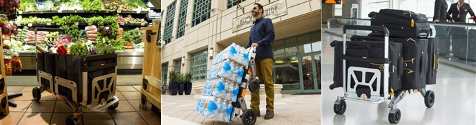

\- **오르가미형** 기술을 활용하여 카트의 부피를 최소화함으로써 공간제약을 받지 않고 보관이 가능

-GPS 위치추적을 이용하여 사용하고자 하는 카트의 위치를 모니터링 가능

-**파워트레인**을 이용하여 적은 힘으로 쉽게 적재 이동 가능

-거리센서를 활용하여 다양한 환경에서 자율주행 가능

## 2. 개발 배경 및 필요성

**수많은 종류의 카트들이 존재**

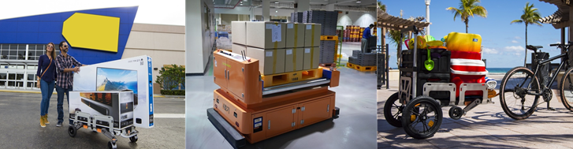

\-  하나의 카트로 다양한 산업현장 용도에 맞추어 사용이 가능한 스마트 이동 보조 장치가 필요

\- 현재 인건비 절감 및 자동화 공정 효율성을 높이기 위해 사물인터넷과 무인 자율주행 기술을 접목시킨 무인 운반차(AGV) 개발 프로젝트가 활발

\- 오르가미형 기술을 활용하여 다양한 크기의 물건을 이동시킬 수 있고 뛰어난 공간활용 능력을 기반으로 협소한 공간에서도 사용이 가능하기 때문에 무인 매장, 첨단 자동화 공장, 물류센터, 병원 등 다양한 분야에서 활용성 있게 사용이 가능하기 때문에 개발이 필요

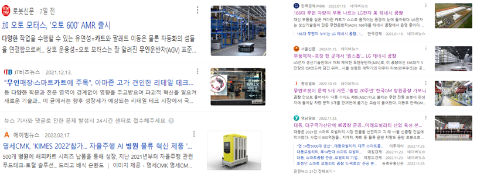

## 3. 프로젝트 특·장점

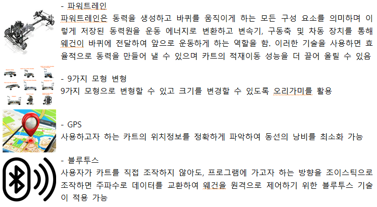

# 프로젝트 내용

## 1. 프로젝트 구성도

**하드웨어 구성도**

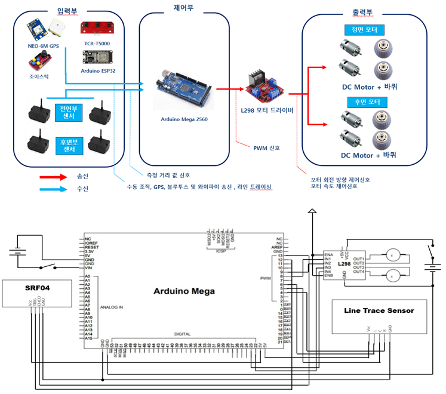

**S/W** **구성도**

\- DC모터 브리지를 제어하여 소프트웨어 코드

\- 외부 기기 통신과 내부 동작을 제어하는 아두이노를 분리. Master-Slave 형태의 복합적인 설계 구조

\- Master-Slave 구조를 이용한 멀티제어 시스템 

\- I2c통신으로 스마트 기기와 MAster가 통신을 하며, master는 명령 받은 내용을 서브장치들로 전달 
   하여 각각의 카트 모형 동작을 구현 가능

**시스템 구성도**

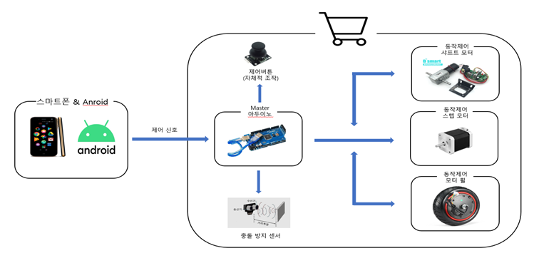

## 2. 프로젝트 기능

**전체 기능 목록**

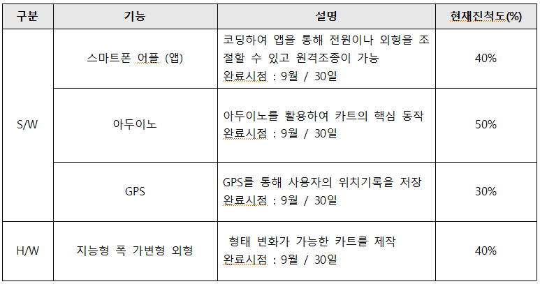

**S/W** **주요기능**

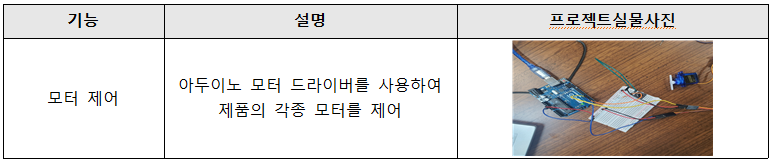

**H/W** **주요 기능** 

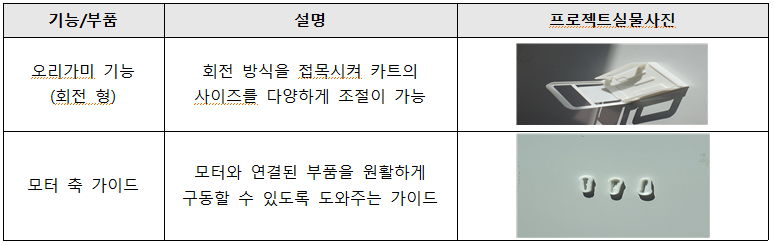

## 3. 주요 적용 기술

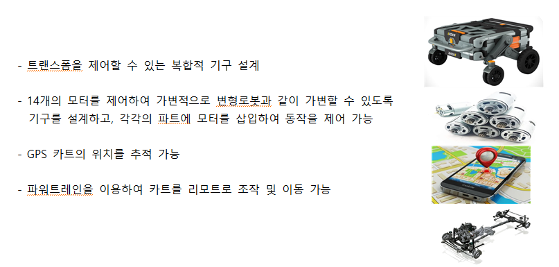

## 4. 프로젝트 개발 환경

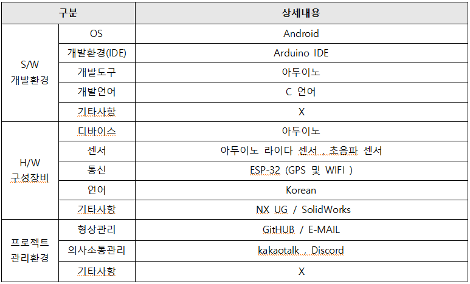

## 5. 기타 사항 [본문에서 표현되지 못한 프로젝트의 가치(Value)] 및 제작 노력

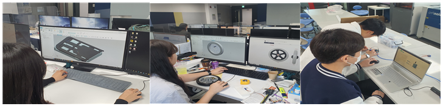

 \- 목업(Mock-Up) 제작

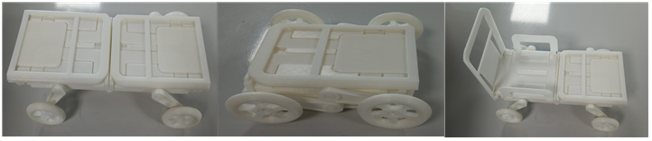

 \- 프로젝트 예상 실물

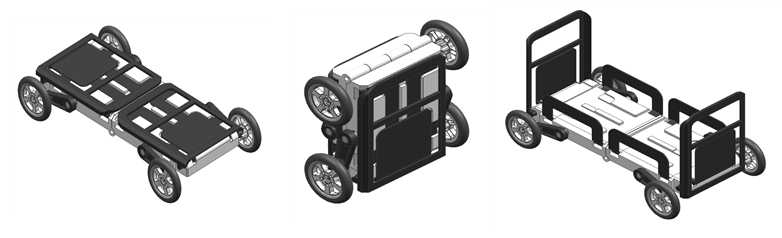

# 프로젝트 수행 내용

## 1. 프로젝트 수행일정

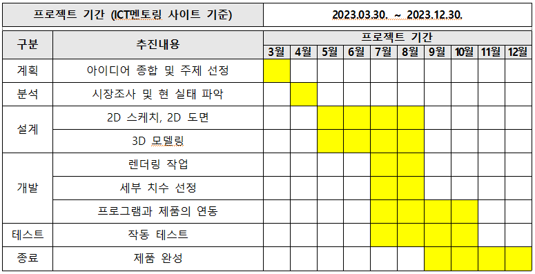

## 2. 프로젝트 추직 과정에서의 문제점 및 해결방안

\- 프로젝트 관리 측면 

   프로젝트를 진행할 때 각자 모델링 파일 관리를 하였는데 통합적으로 하지 않아 파일을 수정 할 때     마다 번거로움이 있어 원드라이브 공유 시스템을 이용하여 원활하게 프로젝트 작업을 수행 

\- 프로젝트 개발 측면 

 구상하고자 하였던 제품의 모델링 작업 도중 제품에 들어가는 부품의 사이즈를 잘못 적용하여 여러번   제품의 형상이 다르게 나와 여러번 재 가공 및 정확한 치수 기입을 통하여 제품을 모델링 제작

## **3.** **프로젝트를 통해 배우거나 느낀 점**

\- ICT프로젝트를 통해 제품이 만들어지는 과정을 자세히 알게 되었고 제품을 구동시키는 과정이 어려웠음

\- 프로젝트를 통해 새로운 기술을 배우고 기존 지식을 실전에 적용해볼 수 있었습니다. 이를 통해 전문성을 향상시키고 자기 계발에 도움이 되었음

\- 학습한 이론을 실전에 적용해보고, 실제 상황에서의 동작과 결과를 경험할 수 있어 성취감을 느꼈음

\- 프로젝트를 통해 얻은 경험과 결과를 분석하고 피드백을 받아 개선해 나가는 과정을 통해 지속적인 학습의 기회를 얻게 되어 배운 것이 많았음

# **기대효과 및 활용분야**

## 1. 프로젝트의 기대효과

## 2. 프로젝트의 활용분야

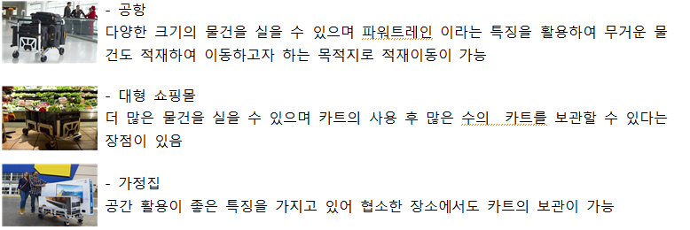

